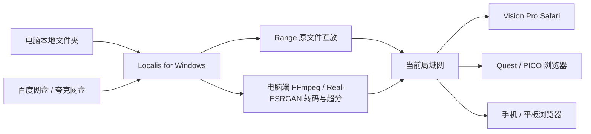

<div align="center">
  

  <br />

  # Localis

  **你的媒体留在电脑上。头显只需要一个网址。**

  Localis 是运行在 Windows 电脑上的私人局域网影院。Vision Pro、Quest、PICO 和手机无需安装 App，使用系统浏览器打开电脑显示的局域网地址，即可播放本地视频、音频、VR180、VR360 与 WebXR 内容。

  [下载 Windows 版](https://github.com/hanxiaoyu-cmd/localis-xr-media-server/releases/latest) · [查看测试报告](./docs/TEST_REPORT.md) · [头显验收清单](./docs/HEADSET_ACCEPTANCE.md)

  <br />

  
  
  
  
</div>

---

## 不给头显再装一个播放器

Localis 的设计原则只有一句：**所有管理与计算都在电脑上完成，头显只负责访问网页和播放最终视频。**

产品定位固定为：**零安装、私有化、带 AI 增强和网盘接入的 XR 媒体网关。** 新功能应优先增强电脑端媒体兼容与交付能力，不要求头显安装 Localis 客户端，不把私人文件、网盘凭据或 AI 计算迁移到第三方云端。



- 视频文件、网盘凭据、转码缓存和 TLS 私钥全部留在电脑。
- 头显不安装 Localis App，不运行超分算法，也不接收网盘登录凭据。
- 浏览器能直接解码的文件走 HTTP Range；其余内容由电脑按需生成 H.264/AAC HLS。
- 标准、高、极致使用可拖动的按需时间线，只生成当前播放位置附近的 4 秒分片；AI 清晰会先在电脑完整生成并缓存整部影片，达到 100% 后才开放播放。

## 三步开始

1. 从 [Releases](https://github.com/hanxiaoyu-cmd/localis-xr-media-server/releases/latest) 下载 `Localis-Setup` 安装版，或 `Localis-Portable` 便携版。
2. 在电脑上启动 Localis，并在 Windows 防火墙提示中允许“专用网络”。点击“添加媒体文件夹”，选择影片目录。
3. 让头显和电脑连接同一个局域网。在头显浏览器中打开 Localis 左侧显示的地址，再输入同一位置的六位配对码。

> Windows 版已经内置 Node.js 运行时、FFmpeg、ffprobe、Real-ESRGAN NCNN Vulkan 与模型。普通用户不需要安装 Python、PyTorch、CUDA 或 Vulkan SDK。电脑仍需保留 Windows 正常工作的显卡驱动。当前安装包尚未购买代码签名证书，Windows SmartScreen 可能显示“未知发布者”；请只从本仓库 Release 下载并核对 SHA-256。

## 为空间视频而做

| 能力 | 实现 |
| --- | --- |
| 本地媒体 | 递归扫描常见视频与音频；原生文件夹选择窗口；路径不发送到头显 |
| 兼容播放 | MP4/WebM 等优先 Range 直放；MKV/TS/AVI/旧编码自动 remux 或转 H.264/AAC HLS |
| HDR 安全播放 | 识别 HDR10、HLG 与杜比视界；兼容流在电脑端显式映射为 SDR BT.709，原文件保持不变并保留设备端尝试入口 |
| 电脑端超分 | 关闭、标准 1.25×、高 1.5×、极致 2×、AI 清晰 2×；所有计算只在电脑执行 |
| 长片跳转 | 完整 VOD 时间线立即返回；用户跳到哪里，电脑优先生成哪里的分片并显示缓存进度 |
| VR / WebXR | 平面、VR180、VR360、Mono、SBS、TB、LR/RL；头显内播放、暂停、跳转与字幕面板 |
| 字幕 | 外挂 SRT/VTT/ASS/SSA 与内封文本字幕统一转换为 WebVTT |
| 百度网盘 | 电脑端首次配置开发者应用身份；之后通过二维码登录，只读访问应用目录 |
| 夸克网盘 | 电脑端安装官方组件、浏览器授权、搜索并完整下载到本地缓存后入库 |
| 私人访问 | 六位配对码、HMAC 签名 HttpOnly Cookie、尝试限速、Host/Origin 校验与路径隐藏 |

“AI 清晰”使用随 EXE 携带的 Real-ESRGAN 通用视频模型，通过 NCNN Vulkan 在电脑显卡逐帧重建，再编码成标准 H.264 HLS；模型转换环境不随软件分发。为控制首段等待和临时空间，原生 4×模型接收映射到 1/2 尺寸的输入并直接产生 2×目标帧，0.5 降噪强度同时抑制压缩噪声。该档适合单目平面与 VR180；SBS/TB 和 VR360 暂使用传统档，后者会逐眼或环绕处理，避免眼间串色和经度接缝。Localis 的 AI 档不是 DLSS、RTX Video 或 FSR 的认证实现。

## 电脑端控制台

只有从 `localhost` 打开的电脑窗口能看到管理能力：

- 六位设备配对码与当前局域网地址。
- 原生文件夹选择器、媒体库刷新和云盘登录。
- 百度应用身份的一次性安全设置与二维码授权。
- 夸克官方组件安装、授权、搜索、下载和缓存进度。

从局域网地址访问的头显与手机只能浏览、配对和播放，无法打开本地文件夹选择器、云盘管理接口或读取配对码。

## 播放策略

| 输入 | 默认路径 |
| --- | --- |
| 浏览器可解码的 MP4/WebM/音频，且超分关闭 | Range 原文件直放 |
| H.264/AAC 位于 MKV/TS 等容器 | fMP4 HLS remux，不重新编码视频 |
| H.264 + 不兼容音频 | 复制视频，只转 AAC 音频 |
| MPEG-4 Part 2、VC-1 等不兼容视频 | H.264/AAC HLS |
| HDR10、HLG、杜比视界 + 兼容流 | 电脑端 Hable 色调映射为 SDR BT.709 H.264；不声称保留 HDR/杜比视界输出 |
| 任意视频 + 标准/高/极致超分 | 电脑端按需缩放、锐化与 H.264/AAC MPEG-TS VOD HLS |
| 单目平面/VR180 + AI 清晰 | 电脑端 Real-ESRGAN 完整预处理；全部 4 秒分片完成后一次性开放 H.264/AAC HLS |
| SRT/VTT/ASS/SSA 文本字幕 | WebVTT |

DRM、加密光盘、蓝光菜单、PGS/VobSub OCR 与专有加密容器不在当前范围。4K/6K/8K、HDR 和极致超分的效果取决于电脑编码能力、Wi-Fi 吞吐与头显解码器。

## WebXR 与 HTTPS

普通局域网 HTTP 可以完成视频和音频播放，但浏览器只在安全上下文开放 WebXR。要同时满足“头显零安装证书”和“局域网 WebXR”，需要自己控制的公共域名、公共可信通配符证书，以及只在家庭 LAN 内把该域名解析到电脑私有 IP。

Localis 提供 Cloudflare DNS-01 证书脚本；媒体仍直接走局域网，不经过 Cloudflare 或其他云服务器。完整配置见 [.env.example](./.env.example)。部分路由器会拦截公共域名返回私有 IP，需要关闭 DNS rebinding protection 或加入私人域名白名单。

## 从源码开发

要求：Windows 11、Node.js 22.13+、FFmpeg/ffprobe 位于 `PATH`。仓库源码模式不会自动使用桌面安装包内的 FFmpeg；Windows 仓库包含用于测试与打包的 AI 运行时。

```powershell
npm install
npm run fixtures
npm run local
```

生产模式与 Windows 打包：

```powershell
npm run build
npm run start:local

# 生成安装版和便携版 EXE
npm run package:win
```

主要配置：

| 变量 | 默认值 | 用途 |
| --- | --- | --- |
| `LOCALIS_MEDIA_DIRS` | 自带测试媒体或空 | 一个或多个本地媒体根目录 |
| `LOCALIS_PORT` | `8080` | 对局域网设备暴露的端口 |
| `LOCALIS_MAX_TRANSCODES` | `2` | 同时进行的电脑端转码/超分任务 |
| `LOCALIS_CACHE_GB` | `20` | HLS 缓存上限 |
| `LOCALIS_CLOUD_CACHE_GB` | `50` | 云盘源文件缓存上限 |
| `LOCALIS_ENCODER` | 实际探测 | 强制 `h264_nvenc`、`h264_mf` 或 `libx264` |
| `LOCALIS_AI_SR_PATH` | Windows 包内置 | 源码调试时覆盖 Real-ESRGAN NCNN 可执行文件 |
| `LOCALIS_AI_SR_MODELS_PATH` | Windows 包内置 | 源码调试时覆盖 NCNN 模型目录 |
| `LOCALIS_PAIR_CODE` | 每次随机 | 固定六位配对码，仅调试使用 |

其余 TLS、百度开发者身份、夸克运行时和安全参数见 [.env.example](./.env.example)。

## 质量门槛

```powershell
npm run lint
npm run typecheck
npm test
npm run build
```

自动化覆盖配对、Range、媒体扫描、字幕、原生文件夹选择、HLS 分流、完整时长 seek、电脑端五档超分、真实 Real-ESRGAN/FFmpeg 转码、SBS/TB 与 360°、云盘协议、容量保护和安全边界。生产页面还在真实 Chromium 中验证长电影远距离跳转与继续播放。

最新环境、逐项结果与没有被伪装成“真机已测”的边界，记录在 [实际测试报告](./docs/TEST_REPORT.md)。Vision Pro、Quest、PICO 的最终设备验收请按 [头显验收清单](./docs/HEADSET_ACCEPTANCE.md) 执行。

## 隐私、许可与贡献

- Localis 首版是只读媒体服务器，不上传、删除、移动或分享网盘文件。
- 百度/夸克账号、Cookie、token、证书私钥和媒体路径不应出现在 Issue、日志截图或公开仓库中。
- 当前 Localis 源码未采用开源许可证，保留所有权利；第三方组件仍各自遵循其许可证。
- Windows 包含独立的 GPLv3 FFmpeg/ffprobe 以及 MIT/BSD-3-Clause Real-ESRGAN 运行时与模型，其来源和许可见 [第三方通知](./THIRD_PARTY_NOTICES.md)。

提交问题前请阅读 [贡献指南](./CONTRIBUTING.md) 与 [安全策略](./SECURITY.md)。

<div align="center">
  <br />
  <sub>Local media. Spatially yours.</sub>
</div>
