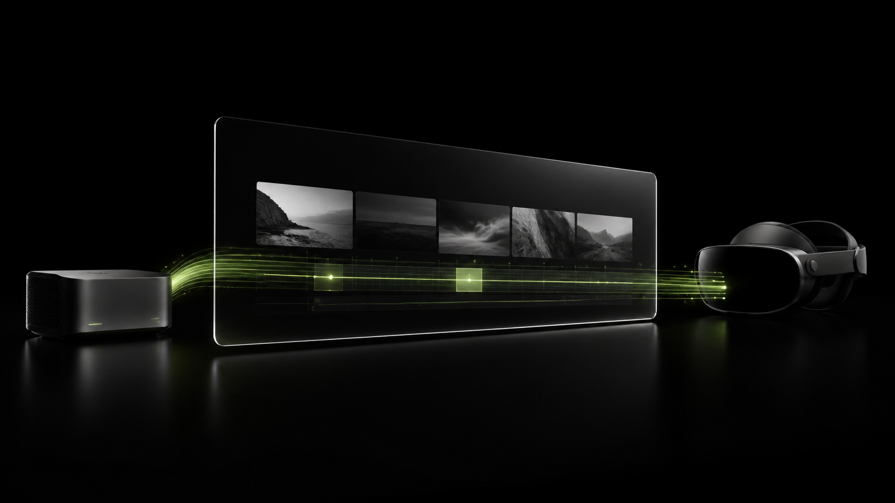
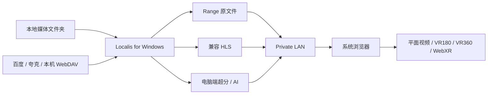

<div align="center">
  

  <br />

  # Localis

  ### 你的媒体，留在你的电脑。空间播放，只需要一个网址。

  **头显零安装 · 私有化运行 · 本地 AI 增强 · 网盘接入**

  Localis 是运行在 Windows 电脑上的 XR 媒体网关。它把本地影片与网盘内容整理、转换并通过当前局域网送到系统浏览器，让 Vision Pro、Quest、PICO、手机和平板无需安装 Localis 客户端即可访问私人媒体库。

  <br />

  [下载最新版](https://github.com/hanxiaoyu-cmd/localis-xr-media-server/releases/latest) · [Android Beta](./android/README.md) · [文档中心](./docs/README.md) · [测试报告](./docs/TEST_REPORT.md) · [路线图](./docs/ROADMAP.md)

  <br />

  [](https://github.com/hanxiaoyu-cmd/localis-xr-media-server/actions/workflows/ci.yml)
  [](https://github.com/hanxiaoyu-cmd/localis-xr-media-server/actions/workflows/ci.yml)
  [](https://github.com/hanxiaoyu-cmd/localis-xr-media-server/releases/latest)
  
  
  
</div>

---

## One computer. Every spatial screen.

Localis 把复杂的事情留给电脑：媒体扫描、格式判断、FFmpeg 转码、Real-ESRGAN 增强、网盘授权与缓存都发生在 Windows 主机。播放端只打开网页，接收最终可播放的媒体流。

> “零安装”指 Vision Pro、Quest、PICO 等播放端无需安装 Localis App、扩展或 AI 运行时。作为网关的 Windows 电脑仍需运行安装版或便携版 Localis。

`Android_beta` 分支另提供一个可选的原生 Android 基础播放器，面向更稳定的手机/平板直放体验。它只负责连接、配对、浏览媒体库和基础播放，不包含超分、AI、网盘管理、WebXR 或 VR 沉浸界面；XR 设备的零安装网页入口仍是产品主路径。详见 [Android Beta 使用说明](./android/README.md)。



| 原则 | Localis 的做法 |
| --- | --- |
| 头显零安装 | 播放端只使用系统浏览器，不要求安装 Localis 客户端、模型或浏览器扩展 |
| 数据私有 | 媒体、缓存、凭据、证书私钥与 AI 计算留在电脑，不经 Localis 公网中继 |
| 可解释播放 | 页面显示实际使用的原片、兼容流、HDR→SDR、传统超分或 AI 路径 |
| 安全回退 | 原片无法稳定解码时切换为电脑端 H.264/AAC HLS，不修改源文件 |

## 三分钟开始

1. 从 [GitHub Releases](https://github.com/hanxiaoyu-cmd/localis-xr-media-server/releases/latest) 下载 Windows x64 安装版或便携版。
2. 启动 Localis。首次出现 Windows 防火墙提示时，只允许“专用网络”。
3. 在电脑窗口点击“添加媒体文件夹”，用 Localis 内置文件夹窗口选择影片目录。
4. 让播放设备与电脑连接同一局域网，打开界面显示的地址并输入六位配对码。
5. 普通视频可通过局域网 HTTP 播放；需要进入 WebXR 时，再配置浏览器信任的 HTTPS。

### 选择发行包

| 文件 | 适合谁 | 行为 |
| --- | --- | --- |
| `Localis-Setup-<version>-x64.exe` | 日常使用 | 可选择安装目录，并创建开始菜单与桌面快捷方式 |
| `Localis-Portable-<version>-x64.exe` | 试用或便携运行 | 不执行安装流程，首次启动会先解压自身 |
| `SHA256SUMS.txt` | 所有人 | 用于核对安装包与 SBOM 的 SHA-256 |
| `Localis-<version>-sbom.cdx.json` | 审计与发布 | CycloneDX 软件物料清单 |

Windows 包已携带 Electron/Node.js 运行时、FFmpeg、ffprobe、Real-ESRGAN NCNN Vulkan 运行时和模型。普通用户不需要安装 Python、PyTorch、CUDA 或 Vulkan SDK；AI 清晰仍需要兼容 Vulkan 的显卡与正常驱动。

当前安装包没有商业代码签名，SmartScreen 可能显示“未知发布者”。请只从本仓库 Release 下载，并使用同一 Release 中的 `SHA256SUMS.txt` 校验文件。

## 影像能力

### 播放管线

| 输入或选择 | 实际路径 |
| --- | --- |
| 浏览器安全范围内的 H.264 8-bit MP4/M4V/MOV，增强关闭 | HTTP Range 原文件直连 |
| H.264/AAC 位于 MKV、TS 等容器 | fMP4 HLS remux，尽量不重新编码视频 |
| H.264 搭配浏览器不稳定音轨 | 保留视频，只把音频转换为 AAC |
| HEVC Main/Main10 或 H.264 High10 | 浏览器解码与显示证据充分时允许原片实验尝试，否则生成 H.264/AAC 兼容流 |
| VC-1、MPEG-4 Part 2 或其他浏览器不安全编码 | 电脑端生成 H.264/AAC 兼容流 |
| HDR10 / HLG | 默认在电脑端映射为 8-bit SDR BT.709；不把兼容流标记为 HDR 输出 |
| 10/12-bit SDR | 使用抖动降为 8-bit 兼容流；转换有损 |
| Dolby Vision / 色彩元数据未知 | 不重建 Dolby Vision 动态元数据；提供保守兼容路径，不保证亮度或色彩正确 |
| 标准 / 高 / 极致 | 电脑端最高约 1.25× / 1.5× / 2× 空间缩放与锐化，按播放位置生成 HLS 分片 |
| AI 清晰 | Real-ESRGAN NCNN Vulkan 最高 2×；完整预处理并缓存整片后才开放播放 |

传统超分遵循“绝不偷偷缩小”：片源已达到档位预算时保持原尺寸并仅做安全锐化；超过 H.264 Level 5.2 安全范围时拒绝该增强档。AI 清晰目前只用于单目平面或单目 VR180；SBS、TB 与 VR360 请使用标准、高或极致，避免眼间串色与环绕接缝。

### XR、字幕与长片

- 平面、VR180、VR360，以及 Mono、SBS、TB、LR/RL 和水平朝向校正。
- WebXR 内提供播放、暂停、前后跳转和退出控制。
- 外挂 SRT/VTT/ASS/SSA 与内封文本字幕统一输出为 WebVTT。
- 传统增强流立即提供完整 VOD 时间线；拖到长片后段时，电脑优先生成目标位置附近的 4 秒分片。
- Apple Safari 使用原生 HLS；Quest、PICO 与桌面 Chromium 优先使用 hls.js/MediaSource，并保留能力回退。
- 播放器可导出包含构建身份、媒体能力判断、实际播放路径、视频状态与 WebXR 状态的诊断 JSON。

### 当前验证边界

Windows 桌面端、真实 FFmpeg/ffprobe 输出、浏览器播放页面和自动化安全边界已有可复查记录，详见 [实际测试报告](./docs/TEST_REPORT.md)。当前没有把 Vision Pro、Quest、PICO 的系统浏览器、HDR 观感、控制器行为或 90 分钟稳定性虚假标记为真机通过。

因此，准确表述是：

- Localis **面向** Vision Pro、Quest 与 PICO 的系统浏览器设计。
- WebXR、VR180/360 和兼容流代码路径已经实现并接受自动化与桌面浏览器验证。
- 三类头显的正式兼容声明仍需完成 [真机验收清单](./docs/HEADSET_ACCEPTANCE.md)。
- “浏览器能解码”不等于端到端 HDR、Dolby Vision 或空间音频已经验证。

DRM、商业流媒体解密、加密光盘、蓝光菜单、PGS/VobSub OCR 和专有加密容器不在当前范围。

## 网盘接入

网盘管理只出现在运行 Localis 的电脑窗口。头显不会看到登录入口、上游 URL、文件 ID、Token 或密码；云端源文件需要兼容处理时，会先完整缓存到电脑，再进入与本地文件相同的播放管线。

| 接入 | 当前实现 | 证据边界 |
| --- | --- | --- |
| 百度网盘 | 用户在电脑端配置自己的开放平台应用身份，通过设备码二维码授权，只读访问应用目录 | 协议与安全边界已测试；真实账号完整闭环仍待验收 |
| 夸克网盘 | 用户明确操作后，从官方仓库安装电脑端组件，在电脑浏览器授权、搜索并完整下载 | 官方组件安装与未登录状态已实机探测；真实账号闭环仍待验收 |
| 本机 WebDAV / OpenList | 高级兼容入口，只接受 `localhost`/`127.0.0.1` 的只读桥接 | 本机 mock 协议、Range、缓存与凭据加密已测试 |

第三方服务的账号状态、限速、API 政策与可用性不由 Localis 保证。真实账号测试要求见 [头显与云盘验收清单](./docs/HEADSET_ACCEPTANCE.md)。

## WebXR 与 HTTPS

浏览器只在安全上下文开放 WebXR：

- `http://localhost` 可用于运行 Localis 的电脑本机开发与测试。
- `http://192.168.x.x:8080` 可以播放普通视频，但大多数头显浏览器会禁用 WebXR。
- 头显进入 WebXR 应使用公共 CA 签发、浏览器直接信任的 HTTPS 域名。

Localis 当前提供 Cloudflare DNS-01 辅助脚本。它创建指向电脑私有 LAN IP 的 DNS 记录并签发通配符证书；DNS 与证书验证使用 Cloudflare，媒体字节仍由播放设备直接从局域网电脑读取，不经过 Cloudflare Tunnel、CDN 或公网媒体中继。

域名可以在阿里云或其他注册商购买，但当前脚本要求该域名的权威 DNS 已托管到 Cloudflare。Cloudflare API Token 只需要目标 Zone 的 DNS 编辑权限，不要使用全局 API Key。

在 PowerShell 中临时设置变量：

```powershell
$env:LOCALIS_BASE_DOMAIN = "lan.example.com"
$env:CLOUDFLARE_ZONE_ID = "your-zone-id"
$env:CLOUDFLARE_API_TOKEN = "zone-scoped-dns-edit-token"
$env:ACME_EMAIL = "you@example.com"
$env:LOCALIS_LAN_IP = "192.168.1.20" # 可选；默认自动探测

npm run tls:provision
```

脚本完成后重启 Localis，并在头显中打开脚本输出的 `https://<hostname>:8080`。如果域名能解析却无法访问，请依次检查 Windows 专用网络防火墙、设备是否在同一 LAN、路由器 AP isolation，以及 DNS rebinding protection；部分路由器需要将该私人域名加入白名单。

当前 HTTPS 流程仍是源码仓库中的运维工具，尚未做成桌面图形向导。证书续期前或电脑 LAN IP 改变后应再次运行 `npm run tls:provision`。完整变量说明见 [.env.example](./.env.example)。

## 从源码运行

### 环境

- Windows 11
- Node.js `22.13.0` 或更高版本
- FFmpeg 与 ffprobe 位于 `PATH`，或设置 `FFMPEG_PATH` / `FFPROBE_PATH`
- 可选：兼容 Vulkan 的 GPU，用于真实 AI 清晰处理

### 开发模式

```powershell
git clone https://github.com/hanxiaoyu-cmd/localis-xr-media-server.git
cd localis-xr-media-server
npm ci
npm run fixtures
npm run local
```

默认入口：

- 电脑管理页：`http://localhost:8080`
- 局域网播放页：`http://<电脑局域网 IP>:8080`
- `3210` 是只监听 `127.0.0.1` 的内部 Web 服务端口，不应对局域网开放。

### 生产构建与桌面包

```powershell
# Web 与媒体服务生产运行
npm run build
npm run start:local

# 构建并启动 Electron 桌面程序
npm run desktop

# 生成 Windows 安装版与便携版
npm run package:win
```

### 常用配置

Localis 直接读取进程环境变量；[.env.example](./.env.example) 是变量参考，不代表应用会自动加载任意 `.env` 文件。

| 变量 | 默认值 | 用途 |
| --- | --- | --- |
| `LOCALIS_MEDIA_DIRS` | 已保存目录或示例媒体 | 一个或多个媒体根目录；Windows 使用分号分隔 |
| `LOCALIS_DATA_DIR` | `%LOCALAPPDATA%\Localis` | 私有配置、凭据、证书与缓存根目录 |
| `LOCALIS_PORT` | `8080` | 对电脑与局域网播放设备提供服务的端口 |
| `LOCALIS_MAX_TRANSCODES` | `2` | 同时运行的转码/增强任务数 |
| `LOCALIS_CACHE_GB` | `20` | HLS 与增强缓存上限 |
| `LOCALIS_CLOUD_CACHE_GB` | `50` | 网盘完整源文件缓存上限 |
| `LOCALIS_MAX_CLOUD_DOWNLOADS` | `1` | 并发网盘下载数，当前最多为 2 |
| `LOCALIS_ENCODER` | 自动探测 | 强制 `h264_nvenc`、`h264_mf` 或 `libx264` |
| `LOCALIS_PAIR_CODE` | 每次启动随机 | 固定六位配对码，仅建议调试使用 |

TLS、百度开放平台身份、AI 运行时覆盖路径与其他高级变量见 [.env.example](./.env.example)。不要把包含真实密钥的命令、终端历史或配置文件提交到 Git。

## 诊断与故障定位

Localis 为每次构建生成统一的 `buildId`、版本号与 commit SHA，并嵌入 Web、媒体服务、Electron 载荷与诊断信息。桌面端发现载荷混用时会拒绝继续启动，播放器发现页面与服务端身份不一致时只自动刷新一次，然后显示可操作错误。

默认 HTTP 运行时可以检查健康状态：

```powershell
Invoke-RestMethod http://127.0.0.1:8080/api/health
```

遇到播放问题时：

1. 在播放器确认“当前影像链路”是否为原片、兼容 HLS、HDR→SDR 或增强路径。
2. 点击“导出诊断”，记录 Localis 版本、设备/浏览器、源容器与编码、网络结构及复现步骤。
3. 检查电脑剩余空间、GPU 驱动、防火墙和 FFmpeg 编码器状态。
4. 启动失败时使用错误页显示的 `localis-desktop.log` 路径定位子进程错误。
5. 提交报告前删除私人文件名、局域网地址、配对码以及任何账号或证书信息。

当前自动化与实测细节统一记录在 [TEST_REPORT.md](./docs/TEST_REPORT.md)。

## 隐私与安全

- 六位配对码换取 HMAC 签名的 HttpOnly、SameSite Strict 会话 Cookie，并限制错误尝试频率。
- 未识别 Host、跨 Origin 写请求和 HLS 路径穿越会被拒绝。
- 媒体文件夹、文件夹浏览与云盘管理接口仅允许已配对的本机回环访问。
- 百度与 WebDAV 凭据使用本机 AES-256-GCM 密钥加密保存；局域网播放 API 不返回上游凭据或绝对媒体路径。
- Localis 面向可信家庭或工作室局域网。不要把 `8080` 端口直接暴露到公网。
- 不要在 Issue、日志截图或诊断附件中公开 Cookie、Token、AppKey/SecretKey、证书私钥、配对码或媒体路径。

安全问题请使用 GitHub 的 [私密漏洞报告](https://github.com/hanxiaoyu-cmd/localis-xr-media-server/security/advisories/new)，不要先创建公开 Issue。详情见 [SECURITY.md](./SECURITY.md)。

## 质量门槛

```powershell
npm run lint
npm run typecheck
npm test
npm run build
npm run build:desktop-server
npm run verify:build-metadata
npm run verify:build-artifacts
```

Windows CI 在 Pull Request 与 `main` 上执行硬件无关验证；Tag Release 还会构建安装版/便携版、验证打包后的构建身份、执行无界面启动烟雾测试，并生成 CycloneDX SBOM 与 SHA-256。真实 Vulkan AI、真实头显、真实网盘账号和长时间 Wi-Fi 稳定性仍需独立验收。

发布机制与资产规则见 [RELEASE_PROCESS.md](./docs/RELEASE_PROCESS.md)。

## 路线图

下一阶段集中于可信 HTTPS 与三类头显真机矩阵、90 分钟长片/弱网测试、HDR 与高位深观感验收、真实百度/夸克账号闭环，以及桌面子进程恢复与诊断能力。

- [后续开发路线图](./docs/ROADMAP.md)
- [头显与真实云盘验收](./docs/HEADSET_ACCEPTANCE.md)
- [HDR / 10-bit 设备档案验收](./docs/P1_HDR_DEVICE_PROFILE_ACCEPTANCE.md)
- [版本变更记录](./CHANGELOG.md)

## 贡献与许可

提交改动前请阅读 [CONTRIBUTING.md](./CONTRIBUTING.md)，并保持产品最重要的边界：**管理与计算在电脑端，播放设备只访问局域网页面。** 行为变化需要测试；播放链路变化还需要真实 FFmpeg 输出或目标设备证据。

Localis 源码当前保留所有权利，并非 OSI 开源许可证项目。Windows 发行包中的 FFmpeg、ffprobe、Real-ESRGAN、Electron 及其他第三方组件继续遵循各自许可证。详情见 [LICENSE.md](./LICENSE.md) 与 [THIRD_PARTY_NOTICES.md](./THIRD_PARTY_NOTICES.md)。

<div align="center">
  <br />
  <sub>Local media. Spatially yours.</sub>
</div>
